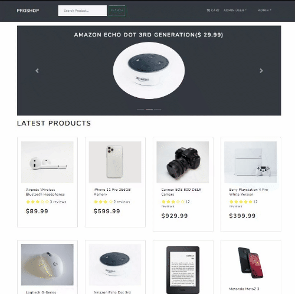
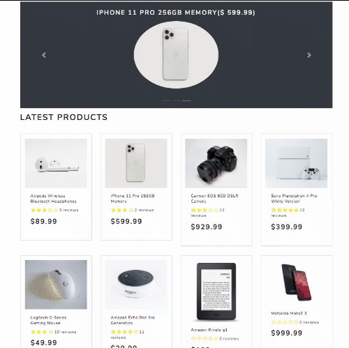

<p align="center">
      
  
  <a href="https://github.com/mikansc/proshop/commits/main">
    
  </a>
  <a href="https://mn-proshop.herokuapp.com/">
    
  </a>
   
</p>
<h1 align="center">
    
</h1>
<p align="center">
PROSHOP é um projeto baseado no curso <a href="https://www.udemy.com/course/mern-ecommerce/">MERN eCommerce from Scratch</a>
</p>
<p align="center">

  </p>
<p align="center">
 <a href="#-sobre-o-projeto">Sobre</a> •
 <a href="#-funcionalidades">Funcionalidades</a> •
 <a href="#-layout">Layout</a> • 
 <a href="#-como-executar-o-projeto">Como executar</a> • 
 <a href="#-tecnologias">Tecnologias</a> • 
 <a href="#-autor">Autor</a> • 
 <a href="#user-content--licença">Licença</a>
</p>

---

<p style="margin-top: 20px">

## ☕ Sobre o projeto

Proshop é um projeto resultado do curso <a href="https://www.udemy.com/course/mern-ecommerce/">MERN eCommerce from Scratch</a>.

Com o desenvolvimento deste projeto, pude desenvolver meus conhecimentos em gerenciamento de estado com Redux, requisições com Axios e localStorage. Aprendi também um padrão de organização de diret´ørios

Este repositório serve como uma base para os demais projetos de porte pequeno que eu desenvolverei a partir de agora.

### [Clique aqui para acessar a demonstração](https://mn-proshop.herokuapp.com/)

---

<p style="margin-top: 20px">

## ⚙ Funcionalidades

<p style="margin-top: 20px">

👉 O visitante da loja pode:

- Navegar pelos produtos, ver descrição, valor, disponibilidade e avaliações
- Adicionar produtos no carrinho de compras
- Alterar quantidade dos produtos no carrinho de compras
- O carrinho de compras fica salvo no localStorage
- Cadastrar uma conta de usuário para realizar a compra
- Cadastrar endereço de entrega, que ficará salvo no localStorage
- Finalizar a compra por meio do PayPal

### Todas as funcionalidades estão no modo sandbox.

👉 O administrador pode:

- Gerenciar os usuários
- Gerenciar os pedidos
- Alterar os pedidos para o status "entregue"
- Adicionar produtos
- Editar produtos

---

<p style="margin-top: 20px">

## 🎨 Layout

O layout foi desenvolvido com <a href="https://getbootstrap.com/">Bootstrap</a> e <a href="https://bootswatch.com/">Bootswatch</a>.

<!-- <h2 align="center"> Mobile 📱 </h2>
<p align="center" style="display: block;">
  
</p>
<p style="margin-top: 20px"> -->
<h2 align="center"> Web 🖥 </h2>
<p style="margin-top: 20px">
<p align="center" style="display: block; width: 100%">
  
</p>
<p align="center" style="display: block; width: 100%">
  
</p>

---

<p style="margin-top: 20px">

## 🔌 Como executar o projeto

Este projeto é composto por um servidor Node/Express, banco de dados Mongo e React no front-end.

####

<p style="margin-top: 20px">

```bash

# Clonar o repositório
$ git clone https://github.com/mikansc/proshop.git

# Acessar a pasta do projeto
$ cd proshop

# Instalar as dependências
$ npm install

# Ajustar as variáveis de ambiente
# Lembre-se de salvar o arquivo somente como .env
$ code .env.example

# Rodar o script de seeder para incluir os dados de exemplo no BD
$ npm run data:import

# Executar a aplicação em modo de desenvolvimento
$ npm run dev

# O comando de rodar em desenvolvimento roda o servidor e o front-end
# O aplicativo inciará na porta:3000 - acesse http://localhost:3000
# O servidor inciará na porta:3001

```

---

<p style="margin-top: 20px">

## 🛠 Tecnologias

As seguintes ferramentas foram usadas na construção do projeto:

#### **Front-end**

- **[React Router](https://github.com/ReactTraining/react-router/tree/master/packages/react-router-dom)**
- **[React Router Bootstrap](https://github.com/react-bootstrap/react-router-bootstrap)**
- **[Axios](https://github.com/axios/axios)**
- **[React Helmet](https://github.com/nfl/react-helmet)**
- **[React Paypal Button v2](https://github.com/Luehang/react-paypal-button-v2)**
- **[Redux](https://redux.js.org/)**
- **[React Redux](https://react-redux.js.org/)**
- **[Redux Thunk](https://github.com/reduxjs/redux-thunk)**
- **[Redux Devtools Extension](https://github.com/zalmoxisus/redux-devtools-extension)**

#### **Server**

- **[Express](http://expressjs.com/)**
- **[Express Async Handler](https://github.com/Abazhenov/express-async-handler)**
- **[Concurrently](https://github.com/kimmobrunfeldt/concurrently)**
- **[BCrypt JS](https://github.com/dcodeIO/bcrypt.js)**
- **[Dotenv](https://github.com/motdotla/dotenv)**
- **[Colors](https://github.com/Marak/colors.js)**
- **[Morgan](https://github.com/expressjs/morgan)**
- **[Multer](https://github.com/expressjs/multer)**
- **[Json Web Token](https://github.com/auth0/node-jsonwebtoken)**

#### **Banco de Dados**

- **[Mongo DB](https://www.mongodb.com/)**
- **[Mongoose](https://mongoosejs.com/)**

> Veja o arquivo [package.json](https://github.com/mikansc/proshop/blob/main/package.json)

<p style="margin-top: 20px">

---

<p style="margin-top: 20px">

## ✋ Autor

<a href="http://www.mkwebdev.com.br/">
 
 <br />
 <sub><b>Michael Nascimento</b></sub></a> <a href="http://www.mkwebdev.com.br/" title="MK WebDev"></a>
 <br />

[](https://www.linkedin.com/in/michaelnsc/)
[](mailto:michael.nsc@outlook.com)

---

<p style="margin-top: 20px">

## 📝 Licença

Este projeto esta sobe a licença [MIT](./LICENSE).

---

<p style="margin-top: 20px">

Baseado no layout do Thiago Marinho 👋🏽 [Entre em contato!](https://www.linkedin.com/in/tgmarinho/)
